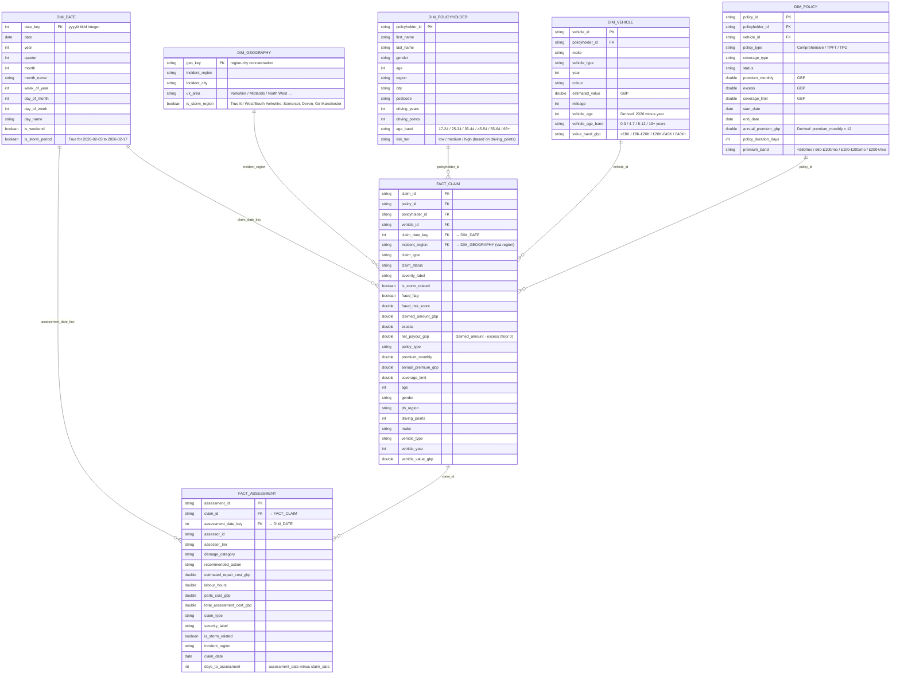
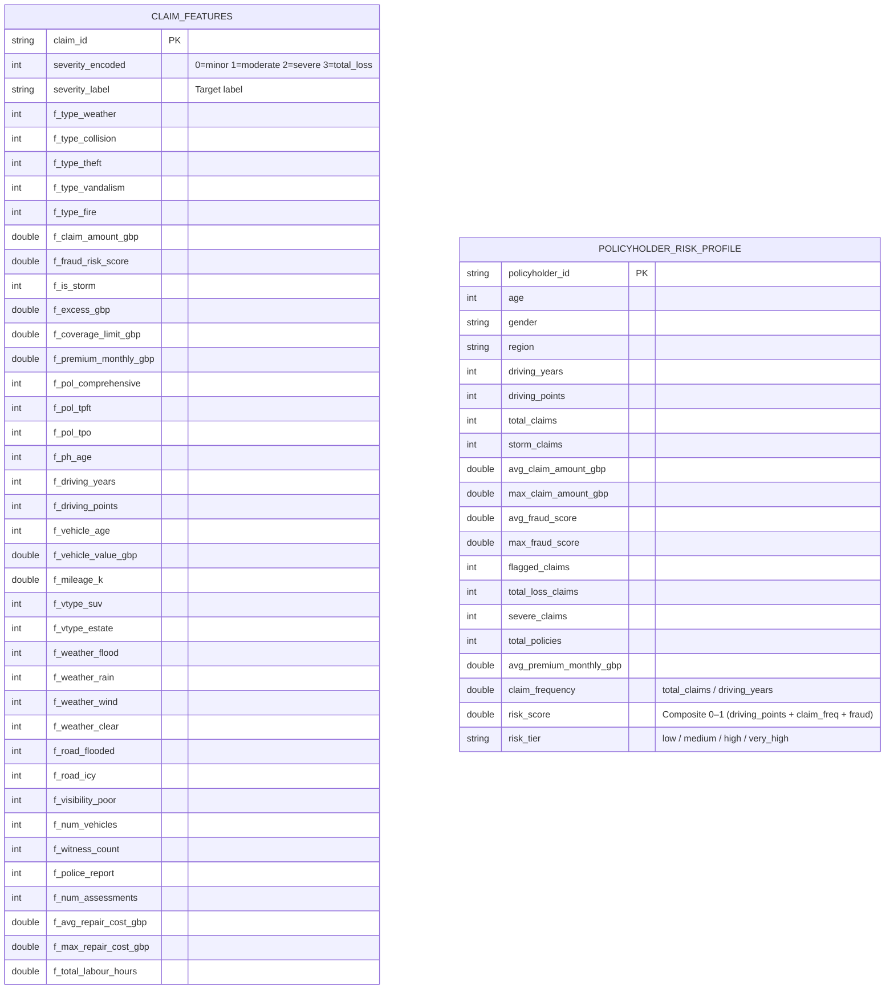

# Insurance Claims — Gold Data Model

**Layer**: `gold_dev` — 4 schemas serving distinct purposes

| Schema | Purpose | Tables |
|---|---|---|
| `dimensions` | Reference / master data for star schema | dim_date, dim_geography, dim_policyholder, dim_vehicle, dim_policy |
| `facts` | Transactional grain tables | fact_claim, fact_assessment |
| `features` | ML-ready feature tables | claim_features, policyholder_risk_profile |
| `summary` | Pre-aggregated BI KPI tables | summary_claims_daily, summary_financial_kpis, summary_fraud_intelligence, summary_triage_performance |

---

## 1. Star Schema — Dimensions & Facts



---

## 2. ML Feature Tables — `gold_dev.features`

Two feature tables, one per ML use case. All columns are numeric or binary-encoded — no free-text fields.



### Feature Engineering Notes

| Feature group | Source tables joined | ML use case |
|---|---|---|
| Claim type flags | `claims` | Severity prediction |
| Policy / excess / limit | `claims` + `policies` | Severity & fraud |
| Policyholder driving profile | `claims` + `policyholders` | Risk scoring |
| Vehicle age & value | `claims` + `vehicles` | Severity prediction |
| Weather / road / visibility | `incidents` | Severity prediction |
| Assessment cost aggregates | `claim_assessments` | Severity & triage |
| Claim history per PH | `claims` aggregated | Risk scoring |

---

## 3. Pre-Aggregated Summary Tables — `gold_dev.summary`

Flat aggregation tables used by BI dashboards. No joins needed at query time.

```mermaid
erDiagram

    SUMMARY_CLAIMS_DAILY {
        date    claim_date            PK  "Grain: date + region + type + severity"
        string  incident_region       PK
        string  claim_type            PK
        string  severity_label        PK
        boolean is_storm_related      PK
        string  month
        date    week_start
        int     claim_count
        double  total_claimed_gbp
        double  avg_claimed_gbp
        double  max_claimed_gbp
        double  approved_amount_gbp
        int     denied_count
        double  settled_amount_gbp
        int     open_count
        int     total_loss_count
    }

    SUMMARY_FINANCIAL_KPIS {
        string  month                 PK  "Grain: month + policy_type + region"
        string  policy_type           PK
        string  incident_region       PK
        int     total_claims
        double  total_claims_gbp
        double  total_net_payout_gbp
        double  avg_claim_gbp
        double  total_monthly_premium_gbp
        double  total_loss_gbp
        double  storm_claims_gbp
        int     unique_claimants
        double  loss_ratio                "net_payout / monthly_premium"
    }

    SUMMARY_FRAUD_INTELLIGENCE {
        string  month                 PK  "Grain: month + region + claim_type + storm flag"
        string  incident_region       PK
        string  claim_type            PK
        boolean is_storm_related      PK
        int     total_claims
        int     flagged_claims
        double  avg_fraud_score
        double  max_fraud_score
        double  flagged_claims_gbp
        double  total_claims_gbp
        double  fraud_rate                "flagged / total"
        double  fraud_amount_ratio        "flagged_gbp / total_gbp"
    }

    SUMMARY_TRIAGE_PERFORMANCE {
        string  month                 PK  "Grain: month + assessor_tier + damage + action + severity"
        string  assessor_tier         PK
        string  damage_category       PK
        string  recommended_action    PK
        string  severity_label        PK
        boolean is_storm_related      PK
        int     total_assessments
        double  avg_days_to_assess
        int     max_days_to_assess
        double  avg_repair_cost_gbp
        double  total_repair_cost_gbp
        double  avg_labour_hours
        int     unique_claims_assessed
        double  severity_action_alignment_rate
    }
```



### Dashboard Mapping

| Summary Table | BI Dashboard |
|---|---|
| `summary_claims_daily` | Claims Operations — daily volume, severity breakdown by region |
| `summary_financial_kpis` | Financial Performance — loss ratio, premiums vs payouts by month |
| `summary_fraud_intelligence` | Fraud Intelligence — fraud rate by region and claim type, storm vs baseline |
| `summary_triage_performance` | Triage & ML Performance — assessment turnaround, write-off alignment |

---

## Data Lineage Overview

```
silver_dev.refined_claims
  ├── policyholders ──────┐
  ├── vehicles ───────────┤
  ├── policies ───────────┤──► gold_dev.dimensions  (dim_policyholder, dim_vehicle, dim_policy, dim_geography, dim_date)
  ├── claims ─────────────┤
  ├── incidents ──────────┤
  └── claim_assessments ──┘
                          │
                          ├──► gold_dev.facts       (fact_claim, fact_assessment)
                          │
                          ├──► gold_dev.features    (claim_features, policyholder_risk_profile)
                          │
                          └──► gold_dev.summary     (summary_claims_daily, summary_financial_kpis,
                                                     summary_fraud_intelligence, summary_triage_performance)
```
