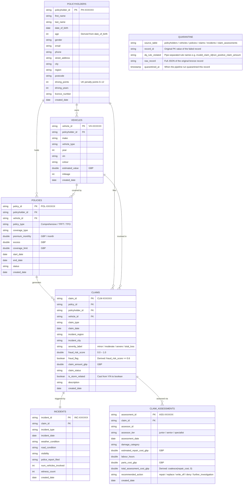

# Insurance Claims — Silver Data Model

**Layer**: `silver_dev.refined_claims`
**Pipeline**: `insurance_poc - Pipeline - Bronze to Silver` (DQ + type casting)

Silver reads from bronze Delta tables, casts all types, applies data quality rules, and writes clean records plus a shared `quarantine` table for all DQ failures.

---

## Entity Relationship Diagram



---

## What Changes from Source → Silver

| Column | Source (Bronze) | Silver | Change |
|---|---|---|---|
| `age` | — not in source | `int` derived from `date_of_birth` | Computed |
| `driving_points` | `string` | `int` | Cast |
| `driving_years` | `string` | `int` | Cast |
| `year` (vehicles) | `string` | `int` | Cast |
| `estimated_value` | `string` | `double` | Cast |
| `premium_monthly` | `string` | `double` | Cast |
| `excess` | `string` | `double` | Cast |
| `coverage_limit` | `string` | `double` | Cast |
| `start_date` / `end_date` | `string` | `date` | Cast |
| `claim_amount_gbp` | `string` | `double` | Cast |
| `fraud_risk_score` | `string` | `double` | Cast |
| `fraud_flag` | — not in source | `boolean` fraud_risk_score >= 0.6 | Computed |
| `is_storm_related` | `string` Y/N | `boolean` | Cast |
| `claim_date` | `string` | `date` | Cast |
| `estimated_repair_cost_gbp` | `string` | `double` | Cast |
| `labour_hours` | `string` | `double` | Cast |
| `total_assessment_cost_gbp` | — not in source | `double` coalesce(repair_cost, 0) | Computed |

---

## Data Quality Rules

### Hard Blocks — record dropped, goes to quarantine only

| Table | Rule | Condition |
|---|---|---|
| policyholders | `invalid_policyholder_id` | `policyholder_id IS NULL OR NOT LIKE 'PH-%'` |
| policyholders | `age_out_of_range` | `age NOT BETWEEN 16 AND 100` |
| vehicles | `invalid_vehicle_id` | `vehicle_id IS NULL OR NOT LIKE 'VH-%'` |
| vehicles | `missing_policyholder_fk` | `policyholder_id IS NULL` |
| policies | `invalid_policy_id` | `policy_id IS NULL OR NOT LIKE 'POL-%'` |
| policies | `missing_policyholder_fk` | `policyholder_id IS NULL` |
| policies | `missing_vehicle_fk` | `vehicle_id IS NULL` |
| claims | `invalid_claim_id` | `claim_id IS NULL OR NOT LIKE 'CLM-%'` |
| claims | `missing_policy_fk` | `policy_id IS NULL` |
| claims | `non_positive_claim_amount` | `claim_amount_gbp <= 0` |
| incidents | `invalid_incident_id` | `incident_id IS NULL OR NOT LIKE 'INC-%'` |
| incidents | `missing_claim_fk` | `claim_id IS NULL` |
| claim_assessments | `invalid_assessment_id` | `assessment_id IS NULL OR NOT LIKE 'ASS-%'` |
| claim_assessments | `missing_claim_fk` | `claim_id IS NULL` |

### Soft Warnings — record passes to clean table AND quarantine

| Table | Rule | Condition |
|---|---|---|
| policyholders | `invalid_email_format` | `email NOT LIKE '%@%'` |
| vehicles | `year_out_of_range` | `year NOT BETWEEN 1990 AND 2030` |
| vehicles | `non_positive_vehicle_value` | `estimated_value <= 0` |
| policies | `end_date_before_start_date` | `end_date <= start_date` |
| policies | `non_positive_premium` | `premium_monthly <= 0` |
| claims | `invalid_severity_label` | `severity_label NOT IN ('minor','moderate','severe','total_loss')` |
| claims | `fraud_score_out_of_range` | `fraud_risk_score NOT BETWEEN 0.0 AND 1.0` |
| claim_assessments | `non_positive_repair_cost` | `estimated_repair_cost_gbp <= 0` |
| claim_assessments | `non_positive_labor_hours` | `labour_hours <= 0` |

---

## Quarantine Table

All DQ-failed records from all 6 source entities land in a **single shared quarantine table**: `silver_dev.refined_claims.quarantine`

```sql
-- How many records failed per table and rule?
SELECT source_table, dq_rule_violated, COUNT(*) AS failed_records
FROM silver_dev.refined_claims.quarantine
GROUP BY 1, 2
ORDER BY 3 DESC;

-- Inspect raw JSON of failed claims
SELECT record_id, dq_rule_violated,
       get_json_object(raw_record, '$.claim_amount_gbp') AS claim_amount_gbp,
       get_json_object(raw_record, '$.severity_label')   AS severity_label
FROM silver_dev.refined_claims.quarantine
WHERE source_table = 'claims';
```
