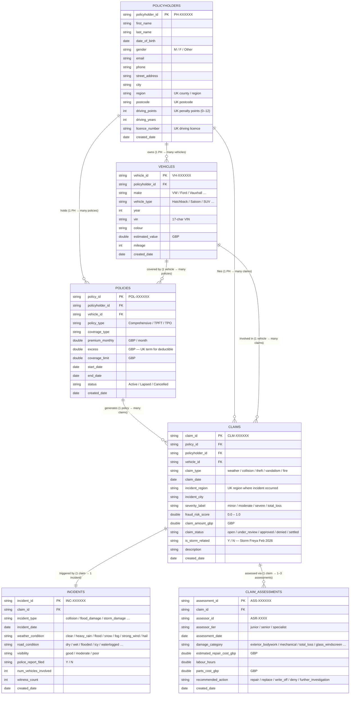

# Insurance Claims — Source Data Model

**Landing layer**: `bronze_dev.raw_claims` (CSV files in Volume → Delta tables via Autoloader)

## Entity Relationship Diagram



---

## Table Descriptions

### POLICYHOLDERS — 50,000 rows
Master record for every insured customer. Age distribution skewed **35–55**; **70% have zero penalty points**. Regions weighted toward Greater London, West Yorkshire and West Midlands.

### VEHICLES — 55,000 rows
Vehicles owned by policyholders. UK-popular makes (VW, Ford, Vauxhall, Toyota, BMW). One policyholder can own multiple vehicles. Values follow a log-normal distribution (~£15K median).

### POLICIES — 60,000 rows
Insurance policies linking a policyholder to a specific vehicle. Policy types follow UK conventions: **Comprehensive** (most common), **Third Party Fire & Theft**, **Third Party Only**. One vehicle can have multiple policies over time.

### CLAIMS — 120,000 rows
Core fact table. **35% of claims (42,000) are Storm Freya related** (Feb 3–17 2026, concentrated in Yorkshire and Somerset). Storm claims show:
- Higher severity distribution (more `severe` / `total_loss`)
- 14% fraud risk rate vs 8% baseline
- Weather `claim_type` dominant

### INCIDENTS — 120,000 rows
One incident record per claim (1:1). Captures the physical circumstances of the event — weather, road conditions, visibility, police involvement. UK weather conditions include `flood`, `heavy_rain`, `strong_wind` reflecting realistic British weather patterns.

### CLAIM_ASSESSMENTS — 180,000 rows
Between 1–3 assessments per claim (~1.5 average). `assessor_tier` determines the level of expertise assigned. `recommended_action` of `write_off` is the UK equivalent of `total_loss`.

---

## Key Business Rules

| Rule | Detail |
|---|---|
| A policy must link to exactly one policyholder and one vehicle | `POLICIES.policyholder_id` and `POLICIES.vehicle_id` are NOT NULL |
| A claim must reference a valid policy | `CLAIMS.policy_id` is NOT NULL |
| Every claim has exactly one incident record | `INCIDENTS.claim_id` is unique |
| A claim can have 1–3 assessments | `CLAIM_ASSESSMENTS.claim_id` repeats |
| Storm Freya period | `claim_date` between 2026-02-03 and 2026-02-17, `is_storm_related = Y` |
| Fraud flag threshold | `fraud_risk_score >= 0.6` → `fraud_flag = true` in silver layer |

---

## Medallion Architecture

```
Volume (CSV)                     bronze_dev.raw_claims
─────────────────────────────    ──────────────────────────────────────────
policyholders/   (51,500 rows)   policyholders  vehicles  policies
vehicles/        (56,650 rows)   claims         incidents  claim_assessments
policies/        (61,800 rows)
claims/         (123,600 rows)         ↓  Bronze → Silver (DQ + type casting)
incidents/      (123,600 rows)
claim_assessments/(185,400 rows) silver_dev.refined_claims
                                 ──────────────────────────────────────────
~3% of rows are intentional      Same 6 tables (clean) + quarantine table
bad data for DQ validation       (all DQ-failed records with raw JSON)

                                       ↓  Silver → Gold (transforms)

                                 gold_dev.dimensions   gold_dev.facts
                                 gold_dev.features     gold_dev.summary
```
